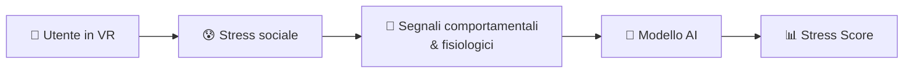
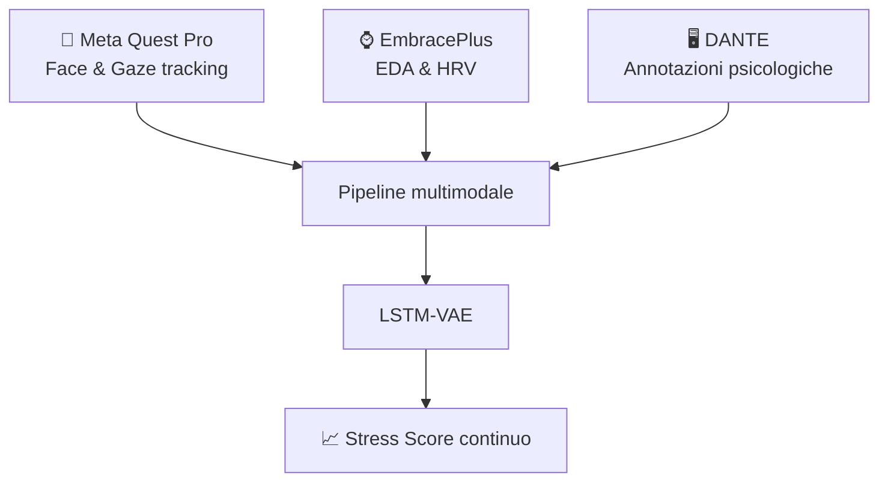
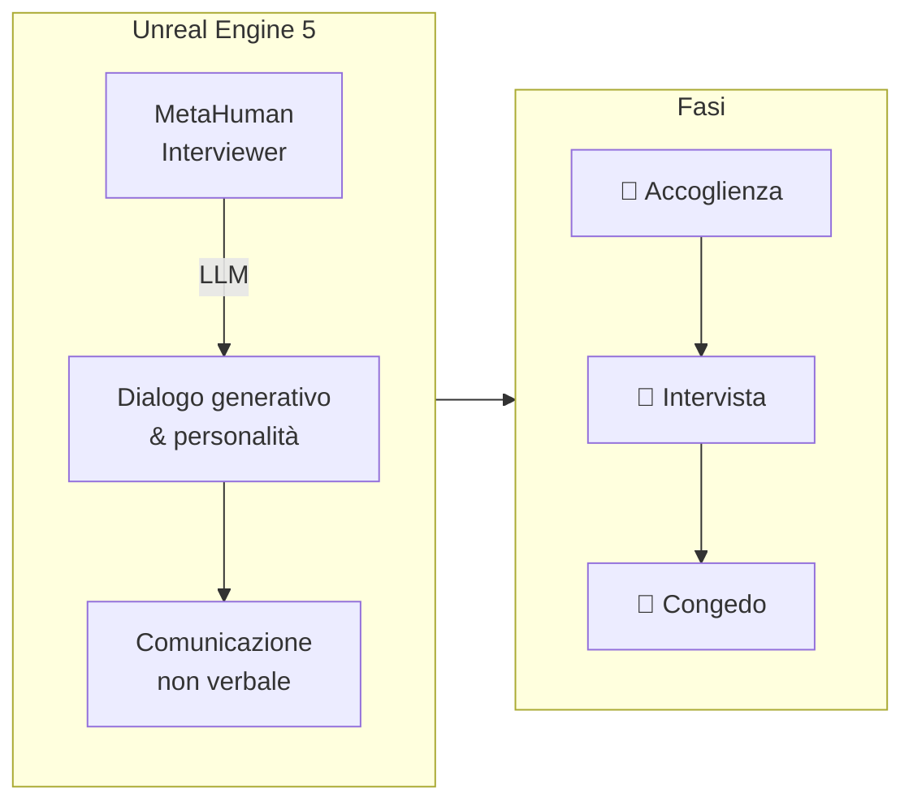
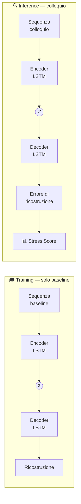
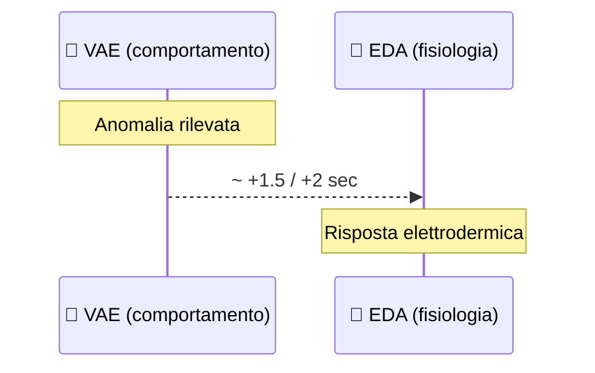
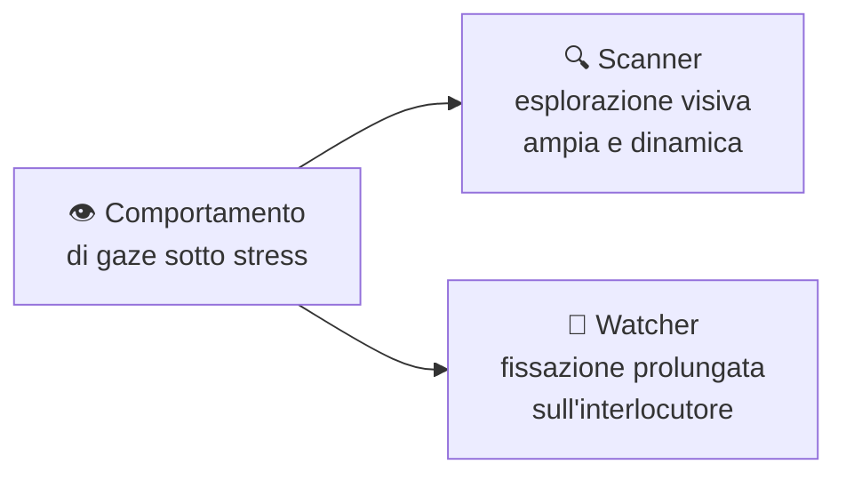
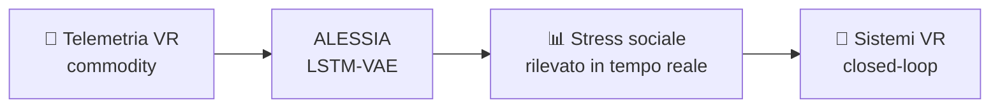

# ALESSIA
## Affective Latent Evaluation of Social Stress in Interview Agents

 

**Christian Pozzoli**

Relatore: Prof. Laura Anna Ripamonti · Correlatore: Dott. Susanna Brambilla

Università degli Studi di Milano — Laurea Magistrale in Informatica — A.A. 2024–2025

---
layout: center
---

# Il Problema

 

> Le interfacce tradizionali **ignorano lo stato interno** dell'utente.
> Il **colloquio di lavoro** è un potente stressor sociale, riproducibile e controllabile.

 

---
layout: center
---

# Research Questions

 

| # | Domanda |
|---|---|
| RQ1 | Face/eye tracking VR → classificazione stress? |
| RQ2 | Errore LSTM-VAE → metrica di deviazione dal baseline? |
| RQ3 | Stress psicologico vs. fisiologico: quale correla di più? |
| RQ4 | Face tracking vs. gaze tracking: contributo relativo? |
| RQ5 | Il modello può essere un *early indicator* dello stress? |

---
layout: two-cols
---

# Il Sistema

::left::

::right::

  

- **Ambiente VR** in Unreal Engine 5
- **MetaHuman** interviewer fotorealistico
- **LLM** per dialogo generativo
- **31 partecipanti**

---
layout: center
---

# L'Ambiente Virtuale

 

 

> Lo scenario concentra i tre ingredienti chiave dello stress valutativo:
> **scrutinio pubblico · pressione da performance · asimmetria gerarchica**

---
layout: center
---

# Il Modello: LSTM-VAE

 

---

# Risultati

 

| Modalità | ROC-AUC | Note |
|---|---|---|
| **Face tracking** | **0.76** | Segnale più stabile e discriminativo |
| Gaze tracking | < Face | Rumore da movimenti spontanei |
| Fusione face + gaze | ↓ vs solo face | Gaze "inquina" il segnale facciale |
| Multi-subject | ~chance | Personalizzazione essenziale |

 

<v-click>

> 🔑 La dimensione **psicologica** (DANTE) correla più della fisiologica con lo spazio latente.

</v-click>

---
layout: two-cols
---

# Analisi Temporale

::left::

::right::

  

- Il modello **precede** la risposta EDA di **1.5–2 s**
- Agisce come **early warning** prima della manifestazione autonomica
- Correlazione con HRV più diffusa: riflette stato tonico, non picchi discreti

---
layout: center
---

# Gaze: due profili emergenti

 

 

> Il gaze è **soggetto-dipendente**: non generalizza tra individui,
> conferma la necessità di modelli personalizzati.

---
layout: center
---

# Conclusioni

 

 

<v-clicks>

- ✅ Stress sociale rilevabile **non invasivamente** da headset VR
- ✅ **Personalizzazione** fondamentale: lo stress è soggetto-dipendente
- ✅ Il modello è un **early indicator**: anticipa la fisiologia di ~2 s
- 🔭 Prossimo passo: adattamento in tempo reale del Virtual Human

</v-clicks>

---
layout: center
---

# Grazie

  

**Christian Pozzoli**

`christian.pozzoli@studenti.unimi.it`

 

Università degli Studi di Milano
Laurea Magistrale in Informatica — A.A. 2024–2025
