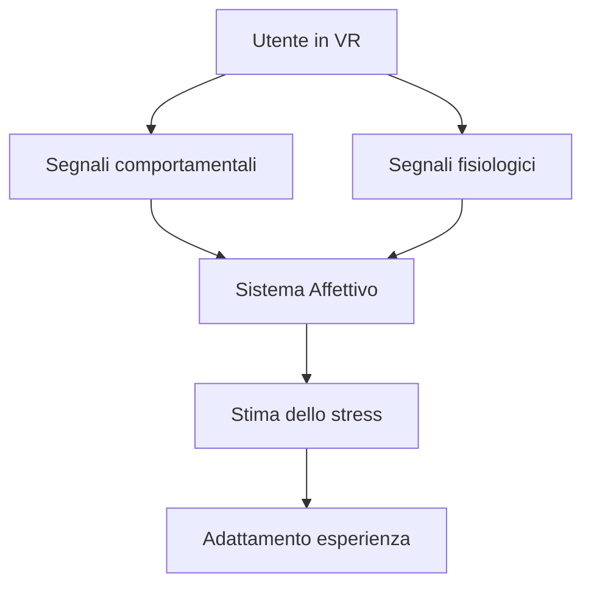
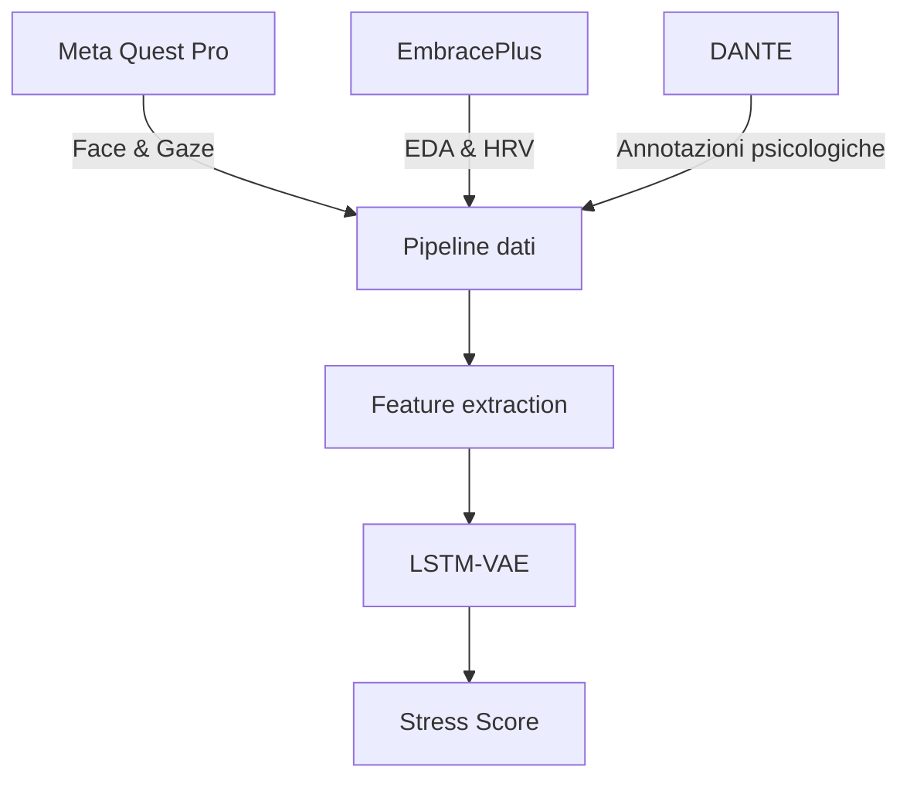
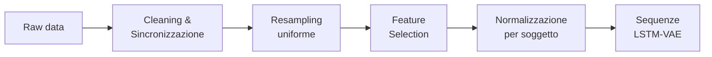
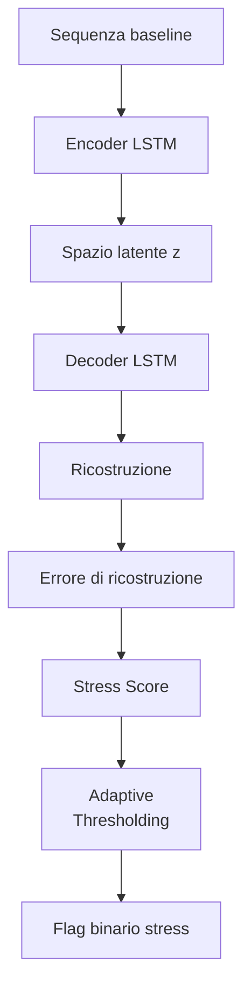
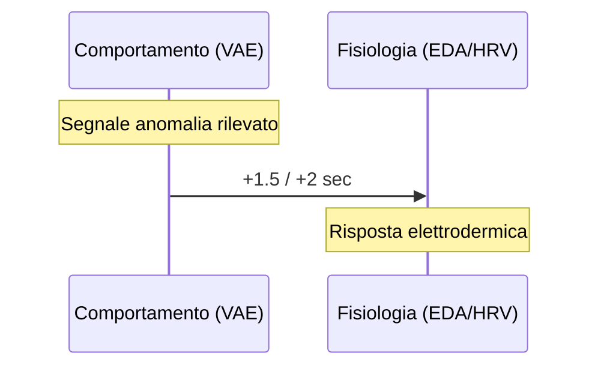

# ALESSIA
## Affective Latent Evaluation of Social Stress in Interview Agents

 

**Christian Pozzoli** — Matricola 29678A

Relatore: Prof. Laura Anna Ripamonti
Correlatore: Dott. Susanna Brambilla

Università degli Studi di Milano
Laurea Magistrale in Informatica — A.A. 2024–2025

---
layout: two-cols
---

# Motivazione

::left::

<v-clicks>

- Le interfacce tradizionali **ignorano lo stato interno** dell'utente
- L'**Affective Computing** (Picard, 1997) propone sistemi capaci di riconoscere e rispondere alle emozioni
- La **Realtà Virtuale** consente di esporre l'utente a stimoli sociali in modo controllato e sicuro
- La **legge di Yerkes-Dodson**: troppo poco stress → disimpegno; troppo → crollo delle performance

</v-clicks>

::right::

---

# Il Problema

<v-clicks>

- Il **colloquio di lavoro** è uno scenario ideale per lo stress sociale:
  - Scrutinio pubblico, pressione da performance, asimmetria gerarchica
  - Riproducibile e strutturato
- Domanda di ricerca centrale:

</v-clicks>

 

<v-click>

> **È possibile rilevare lo stress sociale in VR in modo non invasivo, a partire da soli dati comportamentali e biometrici da headset commodity?**

</v-click>

---
layout: center
---

# Research Questions

<v-clicks>

- **RQ1** — I dati biometrici da face/eye tracking VR sono efficaci per classificare lo stress indotto?
- **RQ2** — L'errore di ricostruzione di un LSTM-VAE è un metodo valido per rilevare deviazioni dal baseline?
- **RQ3** — Quale dimensione dello stress (fisiologica vs. psicologica) correla meglio con le feature latenti?
- **RQ4** — Qual è il contributo relativo del face tracking rispetto al gaze tracking?
- **RQ5** — Esiste una latenza temporale tra pattern comportamentali e risposta autonomica?

</v-clicks>

---
layout: two-cols
---

# Il Sistema ALESSIA

::left::

**Tre componenti principali:**

<v-clicks>

1. **Ambiente VR** — Unreal Engine + MetaHuman interviewer generativo (LLM)
2. **Pipeline multimodale** — face/eye tracking (Meta Quest Pro) + EDA/HRV (EmbracePlus) + DANTE
3. **Modello LSTM-VAE** — addestrato sul baseline, produce uno stress score continuo

</v-clicks>

::right::

---

# L'Ambiente Virtuale

<v-clicks>

- **Unreal Engine 5** + MetaHuman: interviewer fotorealistico con espressioni facciali e lip sync
- **LLM** con regole comportamentali: domande strutturate, personalità coerente, comunicazione non verbale
- **Meta Quest Pro**: face tracking a 52 Action Units, eye tracking binoculare, 6-DoF
- Scenario: stanza ufficio realistica, tre fasi
  - *Accoglienza* → *Intervista* → *Congedo*
- Portale web per pre-registrazione candidati (contesto narrativo)

</v-clicks>

---
layout: two-cols
---

# Acquisizione Dati

::left::

### Segnali comportamentali (Meta Quest Pro)
<v-clicks>

- 52 **Action Units** facciali (FACS)
- **Gaze direction** e parametri oculari
- Movimenti testa (6-DoF)

</v-clicks>

 

### Segnali fisiologici (EmbracePlus)
<v-clicks>

- **EDA** — Electrodermal Activity
- **HRV** — Heart Rate Variability
- **BVP** — Blood Volume Pulse

</v-clicks>

::right::

### Annotazioni psicologiche (DANTE)
<v-clicks>

- Annotazione dimensionale continua (arousal/valence)
- Revisione video post-sessione
- Ground truth per la valutazione

</v-clicks>

 

### Dati demografici
<v-clicks>

- Questionario pre/post esperienza
- Familiarità con VR, esperienza colloqui
- **31 partecipanti** totali

</v-clicks>

---

# Pipeline di Elaborazione

<v-clicks>

- **Cleaning**: rimozione artefatti EDA, allineamento timestamp
- **Feature selection**: filtri correlazione, varianza, ADF-KPSS (stazionarietà)
- **Normalizzazione**: per-subject per ridurre differenze inter-individuali
- **Segmentazione**: finestre temporali scorrevoli per l'input al modello

</v-clicks>

---
layout: two-cols
---

# Il Modello: LSTM-VAE

::left::

**Principio di funzionamento:**

<v-clicks>

- Addestrato **solo sul baseline** (stato di riposo)
- Apprende la rappresentazione latente del comportamento "normale"
- Durante il colloquio: misura la **deviazione** dal baseline come errore di ricostruzione
- L'errore diventa uno **stress score continuo**

</v-clicks>

::right::

---

# Architetture Valutate

<v-clicks>

| Configurazione | Descrizione |
|---|---|
| **Single-encoder** | Un encoder per tutte le feature (face + gaze) |
| **Multi-encoder** | Encoder separati per modalità, fusione tardiva |
| **Single-subject** | Addestrato e testato sullo stesso soggetto |
| **Multi-subject** | Leave-one-subject-out (generalizzazione cross-soggetto) |

</v-clicks>

 

<v-click>

> L'obiettivo è capire quanto la **personalizzazione** e la **separazione delle modalità** influenzino le prestazioni.

</v-click>

---

# Risultati Principali

<v-clicks>

- ✅ ALESSIA **induce stress misurabile**: fase colloquio > baseline per tutti i partecipanti
- ✅ **Face tracking** → ROC-AUC **0.76** (discriminazione baseline vs. colloquio)
- ⚠️ **Gaze tracking** → meno stabile, introduce rumore in fusione multimodale
- ✅ **Single-subject** >> **Multi-subject** → la personalizzazione è fondamentale
- ✅ Dimensione **psicologica** (DANTE) correla meglio delle feature fisiologiche con lo spazio latente

</v-clicks>

---
layout: two-cols
---

# Analisi Temporale

::left::

<v-clicks>

- Il modello **anticipa la risposta elettrodermica** di circa **1.5–2 secondi**
- Allineato con le latenze fisiologiche note dell'attivazione simpatica
- Suggerisce che il sistema può fungere da **early warning** dello stress
- La correlazione con HRV è più diffusa: riflette uno stato tonico più che picchi discreti

</v-clicks>

::right::

---

# Analisi del Gaze

<v-clicks>

- Due profili comportamentali emergenti nei partecipanti:
  - **"Scanner"** — esplorazione visiva ampia e dinamica
  - **"Watcher"** — fissazione prolungata sull'interlocutore virtuale
- Lo stress riduce la frequenza di fixation e allunga la durata media
- Il comportamento di gaze è **soggetto-dipendente**: non generalizza tra individui
- Conferma la necessità di modelli personalizzati

</v-clicks>

---

# Risposta alle Research Questions

<v-clicks>

| RQ | Risposta sintetica |
|---|---|
| **RQ1** | Face tracking efficace (AUC 0.76), gaze più volatile |
| **RQ2** | Errore LSTM-VAE valido, ma dipendente dal soggetto |
| **RQ3** | Dimensione psicologica (DANTE) > fisiologica (HRV/SCR) |
| **RQ4** | Face tracking >> gaze; fusione spesso controproducente |
| **RQ5** | Sì: il modello precede l'EDA di ~1.5–2 s (early indicator) |

</v-clicks>

---

# Lavori Futuri

<v-clicks>

- **Telemetria granulare**: micro-tremori nei controller come biosensori passivi, dinamiche posturali della testa
- **Separazione del parlato**: disaccoppiare i movimenti facciali fonetici dai segnali affettivi genuini
- **Architetture attention-based**: Transformer per la modellazione temporale dello stress
- **Loop chiuso**: adattamento in tempo reale del comportamento del VH in base allo stress score
- **Dataset più ampio**: aumentare i partecipanti, diversificare scenari sociali

</v-clicks>

---
layout: center
---

# Conclusioni

 

> ALESSIA dimostra che lo **stress sociale** può essere **rilevato in modo non invasivo** da telemetria VR commodity durante un'interazione sociale realistica con un agente generativo.

 

<v-clicks>

- Framework riutilizzabile: ambiente VR, pipeline dati, baseline di modellazione
- La **personalizzazione** è essenziale: lo stress è un fenomeno soggetto-dipendente
- Primo passo verso sistemi VR **affettivamente consapevoli** e **closed-loop**

</v-clicks>

 
 

**Grazie per l'attenzione.**

---
layout: center
---

# Domande?

 

`Christian Pozzoli` — christian.pozzoli@studenti.unimi.it

Università degli Studi di Milano
Laurea Magistrale in Informatica — A.A. 2024–2025
