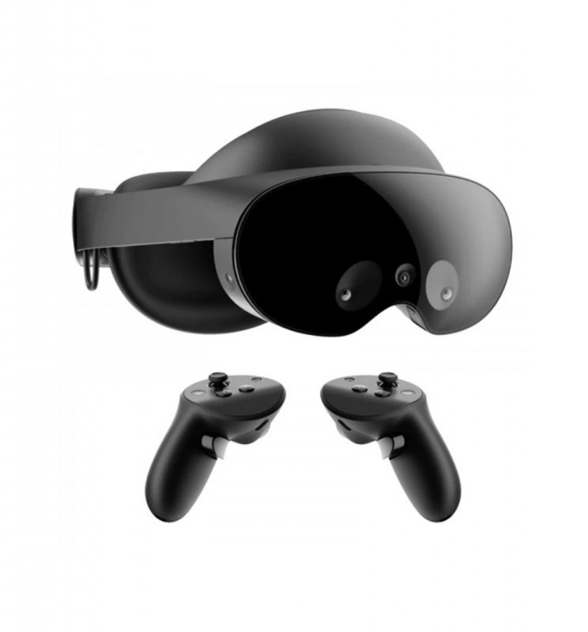
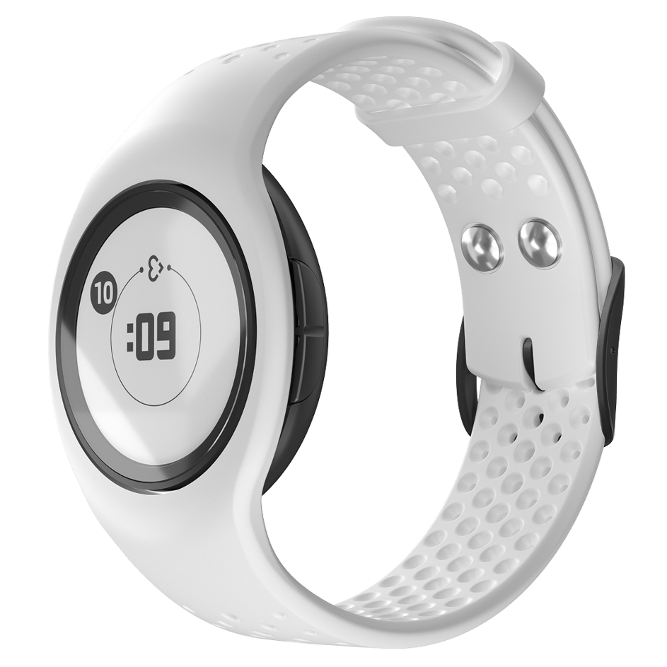
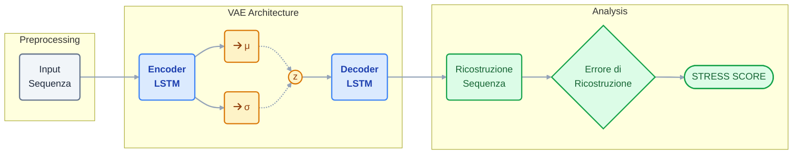
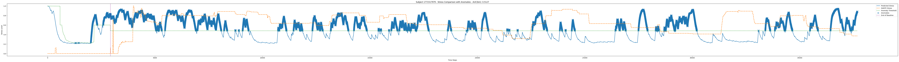

# ALESSIA
### Affective Latent Evaluation of Social Stress in Interview Agents

**Candidato:** Christian Pozzoli  
**Relatore:** Prof. Laura Anna Ripamonti  
**Correlatore:** Dott. Susanna Brambilla  

Anno Accademico 2024-2025

---
layout: two-cols
---

# Il Contesto

 

- Interfacce tradizionali: utente come **dispositivo stateless**
- **VR**: interazioni immersive con stimoli sociali controllati
- **Virtual Human**: da NPC scriptati a agenti generativi fotorealistici

 

- Nuovi scenari: training sociale, public speaking training, terapia di esposizione, colloqui simulati

::right::

	
	
	

---

# Obiettivi

  

    Sviluppare un sistema multimodale per il rilevamento non invasivo dello stress sociale in VR
  

  

    

    

      
Virtual Human generativo

      

      

    

    

      
Pipeline multimodale

      

      

    

    

      
LSTM-VAE

      

      

    

    

      
Validazione

      

      

    

  

---

# Hardware, Tool e Acquisizione

 

  

    
    

    

      
Unreal

      

        MetaXR
        MetaHuman
      

    

  

  

    
    

    

      
Meta Quest Pro

      

        Face Tracking
        Eye Tracking
      

    

  

  

    
    

    

      
Empatica EmbracePlus

      

        EDA
        HRV
        ACC
      

    

  

  

    
    

    

      
DANTE

      

        Stress percepito
      

    

  

---

# Il Virtual Human come Stressor

 

  

    

      <carbon:user-avatar class="text-4xl c-text-primary-500" />
      
Realismo visivo

      
Interviewer fotorealistico con animazioni emotive

    

    

      <carbon:chat class="text-4xl c-text-primary-500" />
      
Dialogo generativo

      
Conversazione contestuale e non scriptata tramite LLM

    

    

      <carbon:pedestrian class="text-4xl c-text-primary-500" />
      
Comunicazione non verbale

      
Prossemica, espressioni e gestualità

    

    

      <carbon:warning-alt class="text-4xl c-text-primary-500" />
      
Tono valutativo

      
Personalità coerente progettata per indurre stress sociale

    

  

  

    
    
    
    
  

---

# Struttura della demo

  

    

      Fase Sperimentale
    

    

    

    

      
= 1 ? 'opacity-75' : 'opacity-100'" class="flex flex-col items-center w-32 text-center transition-opacity duration-500">
        

        
Questionario Demografico

      

      

        

      

      
= 1 ? 'opacity-75' : 'opacity-100'" class="flex flex-col items-center w-32 text-center transition-opacity duration-500">
        

        
Selezione Lavoro

      

      

        

      

      

        
= 1 ? 'w-10 h-10' : 'w-7 h-7'" class="rounded-full c-bg-primary-600 ring-4 c-ring-primary-100 shadow-lg z-30 transition-all duration-500" />
        
= 1 ? 'font-bold c-text-primary-700' : ''" class="mt-2 text-xs leading-tight">Simulazione Colloquio

      

      

        

      

      
= 1 ? 'opacity-75' : 'opacity-100'" class="flex flex-col items-center w-32 text-center transition-opacity duration-500">
        

        
Annotazione DANTE

      

      

        

      

      
= 1 ? 'opacity-75' : 'opacity-100'" class="flex flex-col items-center w-32 text-center transition-opacity duration-500">
        

        
Questionario Valutativo

      

    

  

  
= 2 ? 'max-h-[280px] opacity-100 scale-y-100 mt-5 p-5 c-border-primary-200 overflow-visible delay-75' : 'max-h-0 opacity-0 scale-y-0 mt-0 py-0 px-8 border-transparent pointer-events-none overflow-hidden delay-0'" class="relative bg-white rounded-xl border-2 shadow-xl mx-4 origin-top transition-all duration-750 ease-[cubic-bezier(0.22,1,0.36,1)]">
    

    
Struttura Colloquio

    

      

        

          

        

        

          

        

        

          

        

        

          

        

        

          

        

        

          

        

        

          

        

        

          

        

        

          

        

      

      

        
Baseline

        

        
Presentazione

        

        
Esperienze Passate

        

        
Scenario STAR

        

        
Feedback Finale

      

    

  

  
  
= 2 ? 'opacity-0 max-h-0 mt-0 mb-0 scale-90 pointer-events-none delay-0' : 'opacity-100 max-h-[180px] mt-8 mb-2 scale-100 delay-75'" class="flex items-center justify-between overflow-hidden transition-all duration-750 ease-[cubic-bezier(0.22,1,0.36,1)]">
    
    
    
  

---

# Architettura del Modello

 

 

> Il modello è addestrato **solo sul baseline**. Durante il colloquio, un alto errore di ricostruzione segnala una deviazione dallo stato di riposo.

 
 

---

# Risultati: Face vs Gaze

**Analisi delle Modalità**

- **Face Tracking**: Si è dimostrato l'indicatore più **robusto e coerente**. Le micro-espressioni catturate dal visore sono correlate direttamente all'insorgenza dello stress.
- **Gaze Tracking**: Risultato meno affidabile come predittore unico, influenzato fortemente dal compito visivo (guardare l'intervistatore) più che dallo stato emotivo latente.
- **Performance**: Il modello basato sul volto ha raggiunto un **ROC-AUC di 0.7614**.

---
layout: two-cols
style: 'grid-template-columns: 1fr 2fr;'
---

# Personalizzazione Modello

 

  

    
    Single-Subject vs Leave One Out
  

  

    
    Single-encoder vs Multi-encoder
  

  
= 2 ? 'ps-option-active' : 'ps-option-idle'">
    = 2 ? 'ps-rail-active' : 'ps-rail-idle'">
    Rumore Gaze
  

::right::

  

    

      

Gaze (Single)

      

Gaze (LOO)

      

Face (Single)

      

Face (LOO)

    

    

      

        

          

          

          

          

        

        AP
      

      

        

          

          

          

          

        

        F1
      

      

        

          

          

          

          

        

        AUC exp
      

      

        

          

          

          

          

        

        AUC dante
      

      

        

          

          

          

          

        

        AUC BIN dante
      

    

    

      Confronto tra Single e Leave-One-Out (LOO) per Gaze e Face.
    

  

  

      

        

Gaze (Single-Enc)

        

Face (Single-Enc)

        

Gaze+Face (Multi-Enc)

      

      

        

          

            

            

            

          

          AP
        

        

          

            

            

            

          

          F1
        

        

          

            

            

            

          

          AUC exp
        

        

          

            

            

            

          

          AUC dante
        

        

          

            

            

            

          

          AUC BIN dante
        

      

      

        Confronto tra varianti Unimodali e architettura Multimodale (Late-Fusion).
      

    

  
= 2 ? 'opacity-100 scale-100 z-20' : 'opacity-0 scale-50 z-0 pointer-events-none'">
    
  

---

# Dinamiche Temporali

**Il "Lead Comportamentale"**

- **Anticipazione**: Il modello rileva anomalie facciali e oculari **1.5 - 2 secondi prima** della risposta fisiologica.
- **Validazione**: L'errore di ricostruzione precede i picchi di EDA (sudorazione).
- **Implicazione**: La biometria "esterna" (volto) è un segnale di allerta precoce rispetto alla risposta del sistema nervoso autonomo.

---
layout: two-cols
---

# Conclusioni

 

- Lo stress sociale in VR è rilevabile in modo non invasivo da telemetria commodity
- Il face tracking è il segnale più discriminativo
- La dimensione psicologica correla più di quella fisiologica
- Lo stress è un fenomeno soggetto-dipendente

::right::

  

    

    
= 1 ? 'future-system-visible' : 'future-system-hidden'">
      
Lavori Futuri

      

        

        

          

            
Telemetria granulare

          

        

        

          

            
Separazione del parlato

          

        

        

          

            
Contestualizzazione semantica

          

        

        

          

            
Baseline adattiva

          

        

        

          

            
Validazione fisiologica

          

        

      

    

  

---
layout: center
class: text-center
---

# Grazie per l'attenzione

**Christian Pozzoli** christian.pozzoli@studenti.unimi.it

