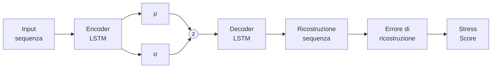

# ALESSIA
### Affective Latent Evaluation of Social Stress in Interview Agents

**Candidato:** Christian Pozzoli  
**Relatore:** Prof. Laura Anna Ripamonti  
**Correlatore:** Dott. Susanna Brambilla  

Anno Accademico 2024-2025

---
layout: two-cols
---

# Il Contesto

 

- Interfacce tradizionali: utente come **dispositivo stateless**
- **VR**: interazioni immersive con stimoli sociali controllati
- **Virtual Human**: da NPC scriptati a agenti generativi fotorealistici

 

- Nuovi scenari: training sociale, public speaking training, terapia di esposizione, colloqui simulati

::right::

	
	
	

---
layout: two-cols
---

# Obiettivi

 

**Sviluppare** un sistema multimodale per il rilevamento non invasivo dello stress sociale in VR.

- Ambiente VR immersivo con un **Virtual Human generativo** come stressor sociale
- Pipeline di acquisizione **multimodale**: face tracking e gaze tracking
- Modello **LSTM-VAE** per la stima continua dello stress tramite deviazione dal baseline
- Validazione tramite segnali fisiologici (**EDA, HRV**) e annotazioni psicologiche (**DANTE**)

---
layout: center
---

# Hardware e Acquisizione

 

  

    
    

    

      
Meta Quest Pro

      

        Face Tracking
        Eye Tracking
      

    

  

  

    
    

    

      
Empatica EmbracePlus

      

        EDA
        HRV
        BVP
      

    

  

---
layout: center
---

# Il Virtual Human come Stressor

 

  

    <carbon:user-avatar class="text-3xl text-blue-500" />
    
Realismo visivo

    
Interviewer fotorealistico con animazioni emotive

  

  

    <carbon:chat class="text-3xl text-blue-500" />
    
Dialogo generativo

    
Conversazione contestuale e non scriptata tramite LLM

  

  

    <carbon:pedestrian class="text-3xl text-blue-500" />
    
Comunicazione non verbale

    
Prossemica, micro-espressioni e gestualità calibrate

  

  

    <carbon:warning-alt class="text-3xl text-blue-500" />
    
Tono valutativo

    
Personalità coerente progettata per indurre stress sociale

  

---
layout: center
---

# Struttura del Colloquio

  

    

      Fase Sperimentale
    

    

    

      
= 1 ? 'opacity-75' : 'opacity-100'" class="flex flex-col items-center w-32 text-center transition-opacity duration-500">
        

        
Questionario Demografico

      

      

        

      

      
= 1 ? 'opacity-75' : 'opacity-100'" class="flex flex-col items-center w-32 text-center transition-opacity duration-500">
        

        
Selezione Lavoro

      

      

        

      

      

        
= 1 ? 'w-10 h-10' : 'w-6 h-6'" class="rounded-full bg-blue-600 ring-4 ring-blue-100 shadow-lg z-30 transition-all duration-500" />
        
= 1 ? 'font-bold' : ''" class="mt-2 text-xs text-blue-700 leading-tight">Intervista Fisiologici

      

      

        

      

      
= 1 ? 'opacity-75' : 'opacity-100'" class="flex flex-col items-center w-32 text-center transition-opacity duration-500">
        

        
Annotazione DANTE

      

      

        

      

      
= 1 ? 'opacity-75' : 'opacity-100'" class="flex flex-col items-center w-32 text-center transition-opacity duration-500">
        

        
Questionario Valutativo

      

    

  

  

    

    
Struttura Colloquio

    

      

        

          

        

        

          

        

        

          

        

        

          

        

        

          

        

        

          

        

        

          

        

      

      

        
Presentazione

        

        
Esperienze Passate

        

        
Scenario STAR

        

        
Feedback Finale

      

    

  

---
layout: center
---

# Architettura del Modello

 

 

> Il modello è addestrato **solo sul baseline**. Durante il colloquio, un alto errore di ricostruzione segnala una deviazione dallo stato di riposo.

---

# Risultati: Face vs Gaze

**Analisi delle Modalità**

- **Face Tracking**: Si è dimostrato l'indicatore più **robusto e coerente**. Le micro-espressioni catturate dal visore sono correlate direttamente all'insorgenza dello stress.
- **Gaze Tracking**: Risultato meno affidabile come predittore unico, influenzato fortemente dal compito visivo (guardare l'intervistatore) più che dallo stato emotivo latente.
- **Performance**: Il modello basato sul volto ha raggiunto un **ROC-AUC di 0.7614**.

---

# Personalizzazione del Modello

 

- La risposta allo stress varia **drasticamente tra individui**: un modello generalista non è sufficiente
- **Single-subject** >> **leave-one-subject-out**: la personalizzazione è essenziale
- Esplorate due architetture encoder:
  - **Single-encoder**: tutte le feature in un unico spazio latente
  - **Multi-encoder**: encoder separati per modalità (face, gaze), fusione tardiva
- La fusione face + gaze **degrada le performance**: il gaze introduce rumore che "inquina" il segnale facciale

---

# Dinamiche Temporali

**Il "Lead Comportamentale"**

- **Anticipazione**: Il modello rileva anomalie facciali e oculari **1.5 - 2 secondi prima** della risposta fisiologica.
- **Validazione**: L'errore di ricostruzione precede i picchi di EDA (sudorazione).
- **Implicazione**: La biometria "esterna" (volto) è un segnale di allerta precoce rispetto alla risposta del sistema nervoso autonomo.

---

# Conclusioni e Lavori Futuri

**Sintesi dei Risultati**
- Lo stress in VR è una dimensione altamente soggettiva.
- Identificazione di profili utente: **"Scanners"** (iper-focalizzati) vs **"Watchers"** (evitanti).

**Evoluzioni Future**
- Analisi dei **micro-tremori** dei controller per aggiungere una dimensione motoria.
- Affinamento della personalità dell'agente tramite feedback neurale in tempo reale.

---
layout: center
class: text-center
---

# Grazie per l'attenzione

**Christian Pozzoli** christian.pozzoli@studenti.unimi.it
